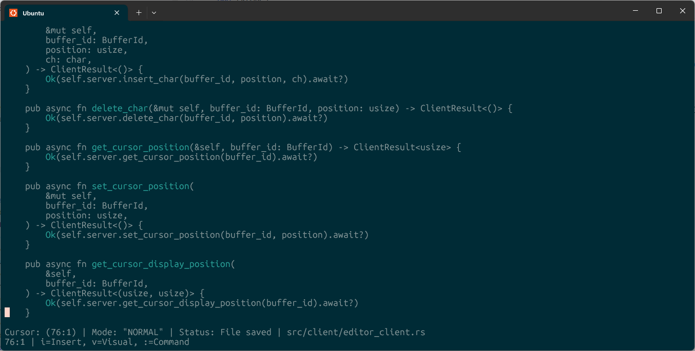

# Rust Text Editor



A terminal-based text editor built in Rust with vim-like keybindings and a client-server architecture.
This is a toy project.


## Features

- **Terminal UI**: Full-screen editing with crossterm integration
- **Multiple editing modes**: Normal, Insert, Visual, and Command modes
- **Vim-like keybindings**: Familiar navigation and editing commands
- **Client-server architecture**: Modular design with separate client and server components
- **Syntax highlighting**: Tree-sitter integration for code highlighting
- **File operations**: Open, save, and create files with modification tracking
- **Dynamic viewport**: Automatic scrolling and cursor positioning
- **Comprehensive testing**: Full test suite for all components

## Quick Start

### Prerequisites

- Rust 1.70+ (2024 edition)
- A terminal that supports ANSI escape sequences

### Installation

1. Clone the repository:
```bash
git clone https://github.com/qTipTip/rust-text-editor.git
cd rust-text-editor
```

2. Build the project:
```bash
cargo build --release
```

3. Run the editor:
```bash
# Create a new file
cargo run

# Open an existing file
cargo run -- path/to/your/file.txt
```

### Basic Usage

The editor starts in **Normal mode**. Here are the basic commands:

#### Normal Mode
- `i` - Enter Insert mode
- `v` - Enter Visual mode (selection)
- `:` - Enter Command mode
- `h/j/k/l` - Move cursor left/down/up/right
- Arrow keys also work for navigation

#### Insert Mode
- `ESC` - Return to Normal mode
- Type to insert text
- `Backspace` - Delete character
- `Enter` - New line

#### Command Mode
- `:w` - Save file
- `:q` - Quit (warns if unsaved changes)
- `:q!` - Force quit without saving
- `:wq` - Save and quit
- `:w filename` - Save as filename
- `ESC` - Return to Normal mode

#### Visual Mode
- `ESC` - Return to Normal mode
- `h/j/k/l` - Extend selection
- Currently supports basic selection (more features coming)

## Architecture

The editor is built with a modular client-server architecture:

### Core Components

```
├── src/
│   ├── editor.rs          # Main editor logic and terminal integration
│   ├── client/            # Client-side components
│   │   ├── editor_client.rs   # Client interface to server
│   │   └── mod.rs
│   ├── server/            # Server-side components
│   │   ├── editor_server.rs   # Buffer and session management
│   │   ├── events.rs          # Event types and IDs
│   │   ├── server_client.rs   # Internal client representation
│   │   └── mod.rs
│   ├── text_buffer.rs     # Text buffer with ropey integration
│   ├── syntax.rs          # Syntax highlighting with tree-sitter
│   └── main.rs            # Entry point
```

### Component Interaction

1. **Editor** (`src/editor.rs`)
   - Main orchestrator that manages the terminal UI
   - Handles user input and renders the interface
   - Communicates with the client for all buffer operations

2. **EditorClient** (`src/client/editor_client.rs`)
   - Provides high-level API for editor operations
   - Maintains connection to the server
   - Manages active buffers for the client

3. **EditorServer** (`src/server/editor_server.rs`)
   - Manages multiple text buffers
   - Handles client connections and sessions
   - Provides thread-safe buffer operations

4. **TextBuffer** (`src/text_buffer.rs`)
   - Core text manipulation using the ropey library
   - Tracks cursor position and edit modes
   - Handles modification detection and undo/redo

5. **Syntax** (`src/syntax.rs`)
   - Tree-sitter integration for syntax highlighting
   - Language-specific parsing and highlighting

### Data Flow

```
User Input → Editor → EditorClient → EditorServer → TextBuffer
                ↓                                        ↓
         Terminal UI ← Rendered Content ← Server Response ← Buffer State
```

## Development

### Running Tests

```bash
# Run all tests
cargo test

# Run specific test modules
cargo test editor_integration_tests
cargo test terminal_integration_tests
cargo test client_server_tests
```

### Code Structure

- **`src/editor.rs`**: Terminal integration, input handling, and UI rendering
- **`src/client/`**: Client-side abstractions and server communication
- **`src/server/`**: Server logic, buffer management, and client sessions
- **`src/text_buffer.rs`**: Core text manipulation and state management
- **`src/syntax.rs`**: Syntax highlighting and language support
- **`tests/`**: Comprehensive test suite covering all components

### Key Design Decisions

1. **Client-Server Architecture**: Enables future multi-client support and separates concerns
2. **Ropey for Text Handling**: Efficient rope data structure for large files
3. **Tree-sitter for Syntax**: Fast, incremental parsing for syntax highlighting
4. **Crossterm for Terminal**: Cross-platform terminal manipulation
5. **Async/Await**: Non-blocking operations for better responsiveness

## Contributing

We welcome contributions! Here's how to get started:

### Setting Up Development Environment

1. Fork the repository
2. Create a feature branch: `git checkout -b feature/your-feature-name`
3. Make your changes
4. Run tests: `cargo test`
5. Run clippy: `cargo clippy`
6. Format code: `cargo fmt`

### Guidelines

- **Code Style**: Follow standard Rust conventions and use `cargo fmt`
- **Testing**: Add tests for new functionality in the appropriate test file
- **Documentation**: Update this README and add doc comments for public APIs
- **Error Handling**: Use the existing error types and result patterns
- **Async**: Use async/await for any I/O operations

### Areas for Contribution

- **Language Support**: Add more tree-sitter language grammars
- **Editor Features**: Implement more vim commands and features
- **Performance**: Optimize rendering and text manipulation
- **UI Improvements**: Enhanced status lines, themes, and visual feedback
- **Plugin System**: Architecture for extending functionality
- **Multi-file Editing**: Tabs, splits, and buffer management

### Testing Guidelines

- Write unit tests for individual components
- Add integration tests for editor workflows
- Test error conditions and edge cases
- Ensure tests are deterministic and don't depend on external state

### Pull Request Process

1. Ensure your code passes all tests and lints
2. Add or update tests as needed
3. Update documentation if you're changing public APIs
4. Create a clear PR description explaining the changes
5. Reference any related issues

## Troubleshooting

### Common Issues

**Editor doesn't start**: Make sure you're using a compatible terminal and Rust 1.70+

**Rendering issues**: Try a different terminal emulator or check terminal size

**File permissions**: Ensure the editor has read/write permissions for the target file

**Build failures**: Run `cargo clean` and try building again

## License

This project is licensed under the MIT License - see the LICENSE file for details.

## Acknowledgments

- Built with [ropey](https://github.com/cessen/ropey) for efficient text handling
- Uses [tree-sitter](https://tree-sitter.github.io/) for syntax highlighting
- Terminal UI powered by [crossterm](https://github.com/crossterm-rs/crossterm)
- Inspired by vim and other modal editors